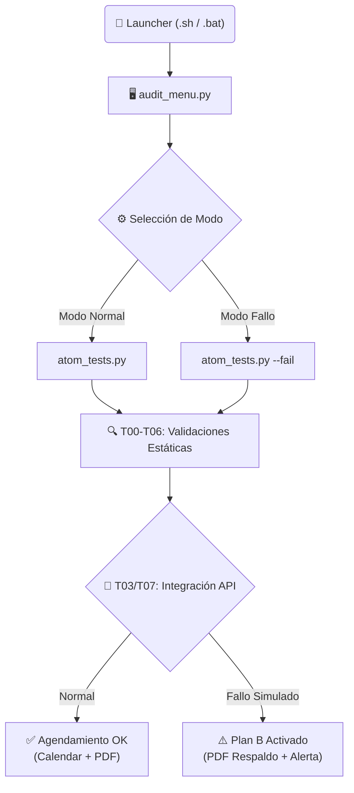
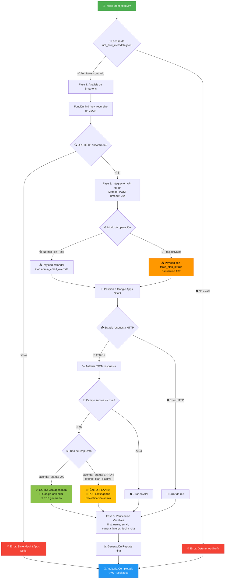

# 🎓 UDF Technical Audit Tool (Interactive CLI)
**Autor:** Jonnathan Peña | **Desarrollado para:** ATOM (Prueba AI Specialist) | **Año:** 2025

Este proyecto implementa una herramienta de auditoría automatizada en Python para validar la integridad y robustez de un flujo conversacional exportado de **Atom Flowbuilder**. Incluye una interfaz de línea de comandos (CLI) interactiva para facilitar la ejecución de pruebas en diferentes entornos.

---

## � Inicio Rápido

El proyecto incluye scripts "inteligentes" que detectan tu sistema operativo, crean el entorno virtual (`venv`) e instalan las dependencias automáticamente.

### 🍎 macOS / � Linux
Abre tu terminal en la carpeta del proyecto y ejecuta:
```bash
./test_atom.sh
```

### 🪟 Windows
Haz doble clic en el archivo `test_atom.bat` o ejecútalo desde CMD/PowerShell:
```cmd
test_atom.bat
```

> **Nota:** La primera ejecución puede tardar unos segundos mientras se instala `requests`. Las siguientes serán instantáneas.

---

## 🎮 Interfaz Interactiva (CLI)

Al iniciar, verás un menú que te guiará en el proceso:

### 1. Configuración de Correos 📧
El sistema te pedirá dos correos (puedes presionar ENTER para usar los valores por defecto):
- **Admin Email:** Recibe los reportes de error y alertas de soporte.
- **Student Email:** Se usa para simular la reserva en el calendario.

### 2. Modos de Auditoría ⚙️
Selecciona qué escenario deseas auditar:

*   **[1] ✅ MODO NORMAL:**
    *   Simula un flujo exitoso donde la API funciona correctamente.
    *   Verifica: Agendamiento en Google Calendar, Generación de PDF y envío de Correos.

*   **[2] ⚠️  MODO FALLO (Prueba de Contingencia T07):**
    *   Simula una caída del servicio de Google Calendar.
    *   **Objetivo:** Verificar que el sistema active el **Plan B** (PDF de respaldo sin evento) y notifique a soporte.

---

## 🧪 Cobertura de Pruebas (T00 - T07)

El script `atom_tests.py` ejecuta 8 casos de prueba críticos de forma secuencial:

| Test ID | Nombre | Descripción y Validación |
| :--- | :--- | :--- |
| **T00** | **Validación de Prompts** | Analiza la integridad de los *Smartons*. <br>• **#1 Asesor:** Busca "Extracción de datos", "Base de conocimiento" y **Ejemplos de Carreras**. <br>• **#2 Agendar:** Verifica instrucciones mandatorias y pasos críticos (Hora). <br>• **#3 Post-Venta:** Verifica contexto y **Ejemplos Post-Venta**. |
| **T01** | **Oferta Académica** | Verifica que el bot tenga conocimiento sobre carreras. Busca keywords como *"Carrera"*, *"Programas"*, *"Ingeniería"*. |
| **T02** | **Requisitos** | Valida si el flujo responde a consultas de admisión (cédula, título, etc.). |
| **T03** | **Agendamiento E2E** | (Solo Modo Normal) Prueba la integración real con Google Calendar y Drive (PDF). |
| **T04** | **Captura de Contexto** | Confirma que variables críticas (`first_name`, `email`, `carrera_interes`) se guarden en memoria. |
| **T05** | **Cambio de Opinión** | Simula un usuario cambiando de carrera a mitad del flujo y valida la actualización de la variable. |
| **T06** | **Memoria** | Verifica que el bot mantenga el hilo de la conversación sin repetirse. |
| **T07** | **Plan B (Resiliencia)** | (Solo Modo Fallo) Valida la respuesta ante errores: <br>✅ Detecta fallo controlado <br>✅ Genera PDF de contingencia <br>✅ Alerta a Soporte. |

---

## 📂 Estructura del Proyecto

*   `audit_menu.py`: Script principal que maneja la interfaz de usuario.
*   `atom_tests.py`: Núcleo lógico de las pruebas y validaciones.
*   `test_atom.sh` / `test_atom.bat`: Launchers inteligentes multiplataforma.
*   `requirements.txt`: Lista de dependencias (principalmente `requests`).
*   `udf_flow_metadata.json`: Archivo fuente del flujo (Entrada de la auditoría).

---

## 📊 Diagrama de Flujo



## 📊 Como Probamos la API de Google Apps Script

